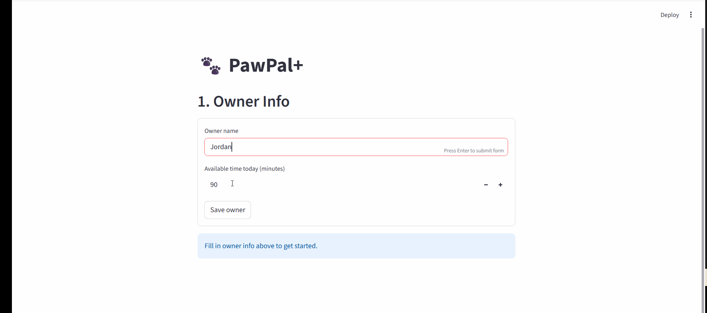

# PawPal+ (Module 2 Project)

You are building **PawPal+**, a Streamlit app that helps a pet owner plan care tasks for their pet.

## Scenario

A busy pet owner needs help staying consistent with pet care. They want an assistant that can:

- Track pet care tasks (walks, feeding, meds, enrichment, grooming, etc.)
- Consider constraints (time available, priority, owner preferences)
- Produce a daily plan and explain why it chose that plan

Your job is to design the system first (UML), then implement the logic in Python, then connect it to the Streamlit UI.

## What you will build

Your final app should:

- Let a user enter basic owner + pet info
- Let a user add/edit tasks (duration + priority at minimum)
- Generate a daily schedule/plan based on constraints and priorities
- Display the plan clearly (and ideally explain the reasoning)
- Include tests for the most important scheduling behaviors

## 📸 Demo



## Features

| Feature | Algorithm / Logic | Where in code |
|---|---|---|
| **Priority scheduling** | Greedy sort — tasks ranked high→medium→low, scheduled in order until the owner's time budget runs out | `Scheduler.generate_plan()` |
| **Sorting by time** | `sorted()` with a lambda key on `HH:MM` strings; tasks with no time set use `"99:99"` as a fallback so they always land last | `Pet.get_tasks_sorted_by_time()` |
| **Status filtering** | List comprehensions filtering on `task.completed`; one focused method per use case plus a general `filter_tasks_by_status(bool)` | `Pet.get_pending_tasks()`, `get_completed_tasks()`, `filter_tasks_by_status()` |
| **Filter by pet name** | Iterates `owner.pets` with a case-insensitive name match, returns that pet's task list or `[]` | `Owner.get_tasks_for_pet(name)` |
| **Daily recurrence** | On completion, `next_occurrence()` builds a fresh `Task` copy with `due_date = current due_date + 1 day` using `timedelta(days=1)` | `Task.next_occurrence()`, `Pet.complete_task()` |
| **Weekly recurrence** | Same as daily but `timedelta(days=7)`; base date chains from the completed task so repeated completions advance correctly | `Task.next_occurrence()`, `Pet.complete_task()` |
| **Conflict warnings** | Groups all pending tasks by `scheduled_time` into a dict; any slot with more than one task is a conflict | `Scheduler.detect_conflicts()`, `explain_conflicts()` |
| **Time budget tracking** | Running `time_used` counter checked before each task with `has_time_for()`; tasks that don't fit are moved to a `_skipped` list | `Scheduler.generate_plan()`, `Owner.has_time_for()` |

## Smarter Scheduling

Beyond the basic priority-based daily plan, PawPal+ includes several logic improvements:

- **Time-based sorting** — tasks can be given an optional `scheduled_time` in `HH:MM` format. `get_tasks_sorted_by_time()` returns them in chronological order; tasks with no time set are placed last.
- **Flexible status filtering** — `get_pending_tasks()`, `get_completed_tasks()`, and `filter_tasks_by_status(completed=True/False)` let you view tasks by completion state. `Owner.get_tasks_for_pet(name)` returns all tasks for a specific pet by name (case-insensitive).
- **Recurring tasks** — a `Task` can be marked `recurrence="daily"` or `recurrence="weekly"`. When completed via `pet.complete_task(title)`, a fresh copy is automatically appended with a `due_date` of today + 1 day (daily) or today + 7 days (weekly).
- **Conflict detection** — `Scheduler.detect_conflicts()` scans all pets for tasks sharing the same `scheduled_time` slot and returns each overlapping group. `explain_conflicts()` prints a readable report, and conflicts are also flagged at the bottom of `explain_plan()`.

## Testing PawPal+

### Run the tests

```bash
python -m pytest tests/test_pawpal.py -v
```

### What the tests cover

| Area | Tests |
|---|---|
| **Task completion** | Marking a task complete flips `completed` to `True` |
| **Task addition** | Adding tasks increments `pet.tasks` correctly |
| **Sorting** | Tasks are returned in chronological `HH:MM` order; tasks with no time sort last |
| **Recurrence** | Completing a `daily` task appends a new task due tomorrow; `weekly` tasks land 7 days out; non-recurring tasks never auto-append |
| **Conflict detection** | Two tasks at the same time slot are flagged; different time slots produce zero conflicts |

### Confidence level

⭐⭐⭐⭐ (4 / 5)

The core scheduling logic — priority sorting, time budget, recurring tasks, and conflict detection — is well covered by tests and behaves correctly for normal use. The remaining gap is edge cases around overlapping task *durations* (the conflict detector only catches exact time-slot matches, not tasks that run into each other), and the Streamlit UI layer has no automated tests.

## Getting started

### Setup

```bash
python -m venv .venv
source .venv/bin/activate  # Windows: .venv\Scripts\activate
pip install -r requirements.txt
```

### Suggested workflow

1. Read the scenario carefully and identify requirements and edge cases.
2. Draft a UML diagram (classes, attributes, methods, relationships).
3. Convert UML into Python class stubs (no logic yet).
4. Implement scheduling logic in small increments.
5. Add tests to verify key behaviors.
6. Connect your logic to the Streamlit UI in `app.py`.
7. Refine UML so it matches what you actually built.
